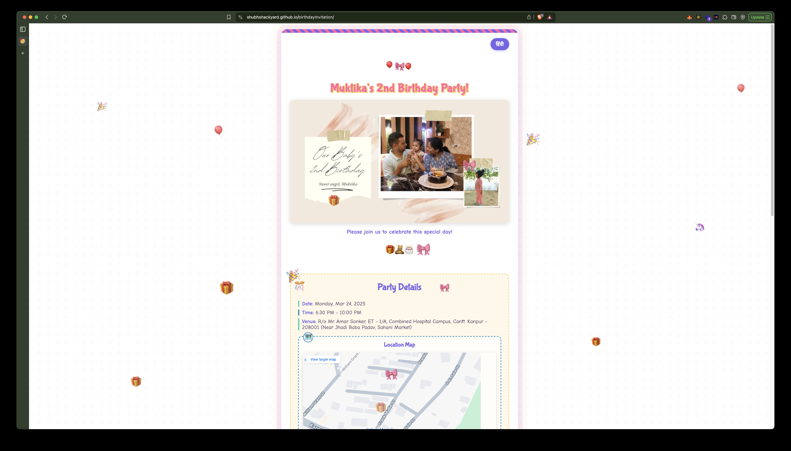

# Birthday Invitation Website

A beautiful, interactive digital birthday invitation. This responsive website features animations, bilingual support (English/Spanish), and a user-friendly RSVP system.



## Features

- 🎬 Eye-catching video/animation greeting
- 🌍 Bilingual support (English and Hindi)
- 📝 Interactive RSVP form with FormSpree integration
- 🗺️ Interactive location map with Google Maps
- 🎉 Celebratory animations (confetti and balloons)
- 📱 Fully responsive design for all devices
- 🔄 Form validation and error handling

## Live Demo

Visit the live invitation at: [https://shubhshackyard.github.io/birthdayInvitation/](https://shubhshackyard.github.io/birthdayInvitation/)

## Technologies Used

- HTML5
- CSS3 (with animations)
- JavaScript (vanilla)
- FormSpree (form handling)
- GitHub Pages (hosting)

## Setup and Installation

1. **Clone the repository**
   ```bash
   git clone https://github.com/shubhshackyard/birthdayInvitation.git
   cd birthdayInvitation
   ```

2. **Test locally**
   - Open `index.html` in your browser to test the site locally
   - Or use a local server: `python -m http.server` and visit `http://localhost:8000`

3. **Deploy to GitHub Pages**
   - Push changes to the `main` branch
   - GitHub Actions will automatically deploy your site

## Customization Guide

### Basic Information

Edit the following in `index.html`:
- Name, date, and party details
- Location information and map embed
- Contact information

### Media Assets

Replace the following files in the `media` folder:
- `birthday-video.mp4` - Main greeting video
- `birthday-animation.gif` - Fallback animation if video doesn't load
- `video-placeholder.jpg` - Poster image for video
- `og-image.jpg` - Preview image for social media sharing
- `favicon.ico` and related files - Website icon

### Form Integration

The RSVP form is configured to work with FormSpree. To use your own form:
1. Create an account at [FormSpree.io](https://formspree.io/)
2. Update the form action URL in `index.html`

### Styling

The site's appearance can be customized by editing:
- `styles.css` - For colors, fonts, spacing, etc.
- Add custom animations by modifying the animation functions in `script.js`

## Browser Compatibility

- Chrome, Firefox, Safari, Edge (latest versions)
- Mobile browsers on iOS and Android
- Includes fallbacks for older browsers

## Credits

- Animations powered by Web Animations API
- Icons from Emoji set
- Map integration via Google Maps
- Form handling by FormSpree

## License

This project is available for personal use and learning. For commercial use, please contact the author.

---

Created with ❤️ by [ShubhShackyard](https://github.com/shubhshackyard)
